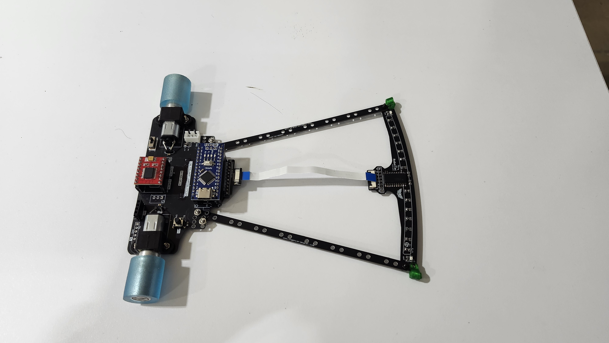
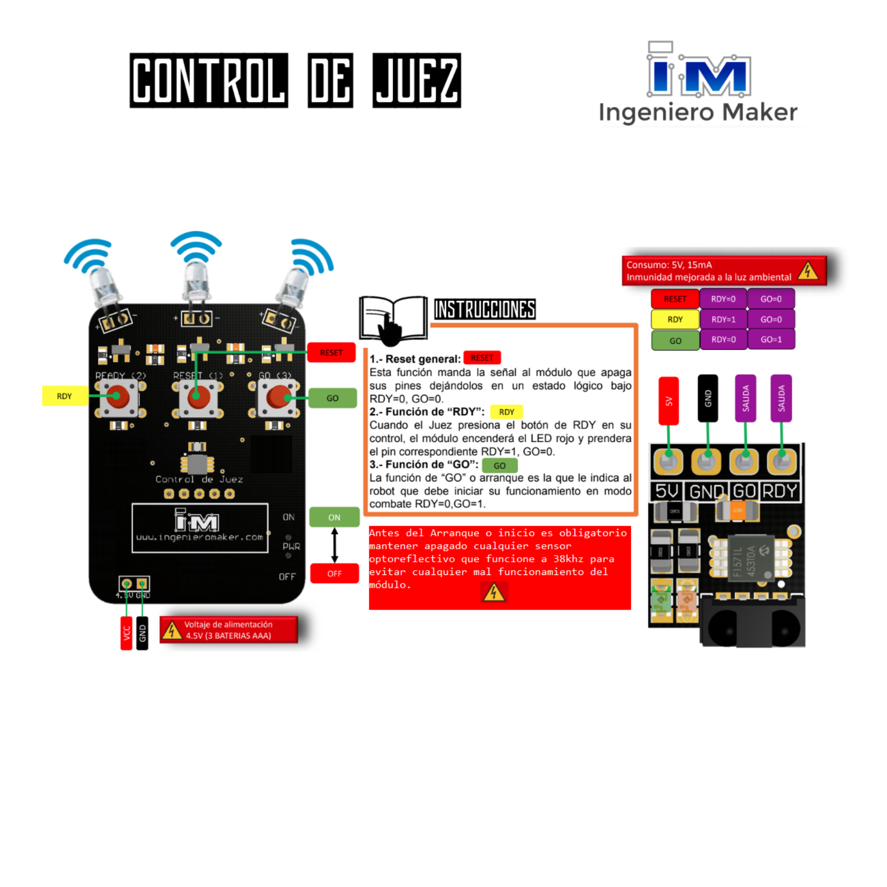

[English](README.md) | [Español](README-es.md)

# RoboTec - Seguidor de Línea Velocista (Exhibición de Arquitectura y Hardware)

*Nota: Este repositorio sirve como una exhibición técnica y portafolio de documentación del proyecto. El firmware principal en C++ es propiedad de la organización y se mantiene en un repositorio privado administrado por el equipo de ingeniería de RoboTec.*

Este proyecto muestra la arquitectura de hardware y la metodología de control desarrollada para la categoría de robótica competitiva de Seguidores de Línea Velocistas. Se basa en un sistema de control PID (Proporcional, Integral, Derivativo) con ajustes dinámicos en tiempo real, frenado predictivo de alta inercia y procesamiento multiplexado de una barra de 16 sensores reflectivos.

---

## Características de Ingeniería

- **Perfiles PID Configurables:** Soporta múltiples perfiles PID (velocidad y agresividad) configurables por el usuario que pueden ser alternados en tiempo real mediante un control físico o la entrada del módulo de arranque. Esto permite el ajuste sobre la marcha sin necesidad de flashear el microcontrolador en la zona de pits.
- **Frenado Predictivo Diferencial:** Algoritmo de detección de extremos para curvas de 90 grados que aplica un "ancla" de reversa interna, neutralizando la fuerza centrífuga a velocidades máximas.
- **Inversión Óptica por Software:** Integración lógica para conmutar el algoritmo entre pistas estándar (línea negra / fondo blanco) y pistas invertidas (línea blanca / fondo negro).
- **Modo Centinela:** Rutina de autocentrado activo a baja velocidad impulsada por las señales lógicas del módulo de arranque.

---

## Arquitectura de Hardware e Integración

Este proyecto depende de módulos de hardware específicos trabajando en sincronía. A continuación se detalla el funcionamiento de cada sistema y su rol en el rendimiento del robot.

### 1. Chasis y Planta Motriz

El robot es impulsado por dos motores DC de 3000 RPM controlados por un driver TB6612FNG. Este controlador fue seleccionado por su capacidad de manejar 1.2A continuos y picos de hasta 3A, operando de forma segura en el rango de 6V a 8.4V proporcionado por la batería LiPo 2S. El regulador de voltaje interno del driver (hasta 500mA) alimenta la lógica del sistema.

### 2. Arreglo de Sensores "Hermes"

Diseñada y ensamblada por Alexander Armando Martinez Gil, la placa "Hermes" es un arreglo frontal personalizado de 16 sensores reflectivos analógicos. Para superar el límite de pines del Arduino Nano, la placa integra un **multiplexor CD74HC4067**. El sistema itera a través de los 16 canales vía 4 pines de control (S0-S3) y lee una única salida analógica (COM), aplicando un algoritmo de promedio ponderado al centro para calcular el error exacto de posición.

### 3. Módulo de Arranque de Competencia

Para cumplir con las normativas oficiales de competencia, el sistema se enlaza con un módulo receptor RF *Ingeniero Maker*. Este provee dos señales lógicas críticas:
* **Señal Ready (Pin D12):** Activa el "Modo Centinela" para mantener el robot centrado en la línea a bajas velocidades antes de la carrera. También actúa como un interruptor manual para ciclar entre los perfiles PID durante la preparación en pits.
* **Señal Go (Pin D10):** Desbloquea el lazo de control PID principal, lanzando el robot a velocidades competitivas.

---

## Lista de Materiales (BOM)

| Componente | Especificaciones | Rol en el Sistema |
| :--- | :--- | :--- |
| **Microcontrolador** | Arduino Nano (ATmega328P) | Procesamiento central y lazo de control PID. |
| **Barra de Sensores** | Placa Custom "Hermes" | Arreglo frontal de 16 sensores. |
| **Multiplexor** | CD74HC4067 | Multiplexación analógica de 16 canales. |
| **Driver de Motores** | TB6612FNG | Control de potencia PWM. |
| **Planta Motriz** | 2x Motores DC (3000 RPM) | Tracción diferencial. |
| **Alimentación** | LiPo 2S (7.4V nominal) | Fuente de poder principal. |
| **Arranque** | Módulo Ingeniero Maker | Receptor RF para señales Ready/Go. |

---

## Esquema de Conexiones (Pinout)

**Motores y Driver TB6612FNG**
* `AIN1`: D8 | `AIN2`: D7 | `PWMA`: D5 (Motor Derecho)
* `BIN1`: D9 | `BIN2`: D4 | `PWMB`: D6 (Motor Izquierdo)

**Arreglo de Sensores "Hermes" (CD74HC4067)**
* `S0`: A3 | `S1`: A2 | `S2`: A1 | `S3`: A0
* `COM` (Salida Analógica MUX): A4

**Módulo de Arranque (Ingeniero Maker)**
* `RDY`: D12
* `GO`: D10

---

## Operación en Competencia (Configuración en Pits)

1. Enciende el robot. El sistema cargará por defecto el primer perfil PID almacenado.
2. Si no se ha recibido la señal `GO`, utiliza la entrada de control (Ready) o el botón integrado para alternar entre los perfiles PID guardados. El LED de la placa indicará el perfil seleccionado actualmente.
3. Al recibir la señal `Ready`, el robot entra en **Modo Centinela**, alineándose con la línea de la pista a baja velocidad para asegurar una posición perfecta.
4. Al recibir la señal `GO`, se habilita el lazo de control PID principal de alta velocidad y comienza la secuencia de carrera.

---

## Créditos y Equipo

* **Arquitectura de Software y Control:** Mauricio Gómez Márquez
* **Ingeniería de Hardware y Diseño PCB:** Alexander Armando Martinez Gil
* **Organización:** Club de Robótica RoboTec

---

## Licencia

La documentación y las presentaciones de la arquitectura de hardware en este repositorio se publican bajo la Licencia MIT. Consulta el archivo [LICENSE](LICENSE) para más detalles. El firmware de control subyacente sigue siendo propiedad exclusiva de la organización.