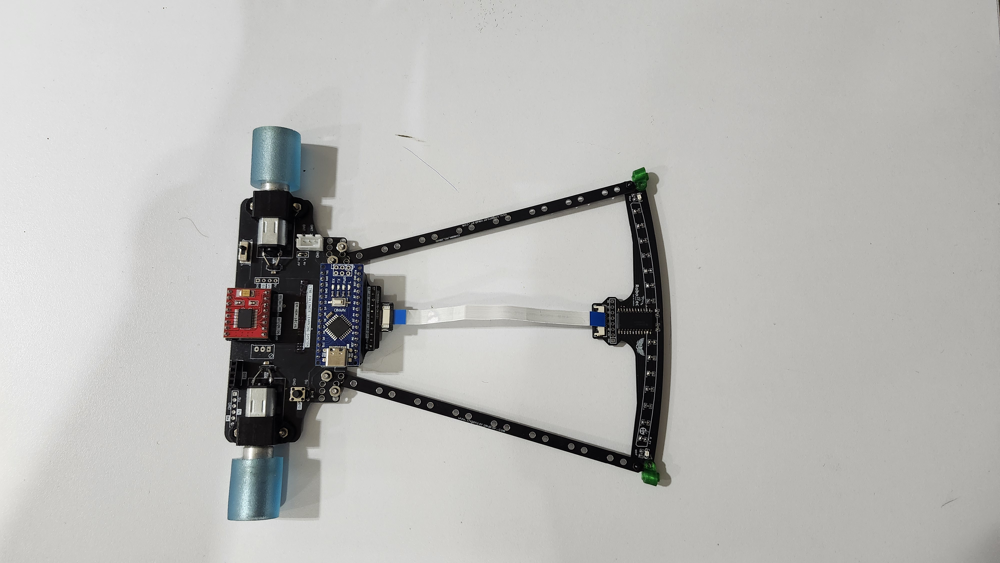

  

# LineFollower General Lee v2: Hardware Architecture Showcase

[English](README.md) | [Español](README-es.md)

## Table of Contents

- [Project Overview](#project-overview)
- [Project Status](#project-status)
- [Hardware Architecture & Features](#hardware-architecture--features)
  - [Chassis & Powertrain](#chassis--powertrain)
  - [Hermes Sensor Array](#hermes-sensor-array)
  - [Competition Start Module](#competition-start-module)
- [Component Integration (BOM)](#component-integration-bom)
- [Wiring Schematic (Pinout)](#wiring-schematic-pinout)
- [Competition Setup (Pit Lane)](#competition-setup-pit-lane)
- [System Architecture & Control Flow](#system-architecture--control-flow)
- [Credits & Team](#credits--team)
- [License](#license)

## Project Overview

The **LineFollower-General-Lee-Version-2** repository serves as a technical showcase and documentation portfolio for the hardware architecture of a high-speed line-following robot (velocista) developed by the **RoboTec** robotics club.

This project demonstrates the engineering behind a competition-grade robot, featuring a custom 16-sensor reflective array ("Hermes") and an advanced Proportional-Integral-Derivative (PID) control system. The design includes dynamic real-time tuning, high-inertia predictive braking, and multiplexed analog processing.

> **Note:** This repository is dedicated to the hardware documentation and architectural overview. The core C++ control firmware remains proprietary and is maintained in a private repository by the RoboTec engineering team.

## Project Status

**Competition Ready / Stable** - The hardware architecture and integration described here represent the final, track-tested iteration of the robot.

## Hardware Architecture & Features

The robot's hardware is engineered for extreme speed, precision, and adaptability on the track. The core control logic features dynamic PID profiles, differential predictive braking for 90-degree curves, and software optical inversion.

Below is the detailed breakdown of the physical modules driving the robot:

### Chassis & Powertrain

  
  &nbsp;
  

The fully assembled chassis houses the high-speed powertrain driven by two 3000 RPM DC motors. These are controlled by a TB6612FNG motor driver capable of handling 1.2A continuous current (3A peak). This powertrain executes the rapid acceleration and the aggressive reverse "anchor" maneuvers required for predictive braking.

### Hermes Sensor Array

  

The "Hermes" board is a custom frontal array of 16 analog reflective sensors designed for high-resolution line tracking. It utilizes a **CD74HC4067 multiplexer** to rapidly cycle through 16 channels, bypassing the Arduino Nano's pin limitations and outputting a precise analog reading for center-weighted average calculations.

### Competition Start Module

  

To comply with official race standards, the robot interfaces with an _Ingeniero Maker_ RF receiver. This module provides critical logic signals:

- **Ready Signal:** Activates "Sentinel Mode", an active low-speed self-centering routine ensuring perfect starting alignment.
- **Go Signal:** Officially unlocks the high-speed main PID control loop, launching the robot.

## Component Integration (BOM)

| Component           | Specifications            | System Role                                                |
| :------------------ | :------------------------ | :--------------------------------------------------------- |
| **Microcontroller** | Arduino Nano (ATmega328P) | Core processing and PID control loop execution.            |
| **Sensor Array**    | Custom "Hermes" Board     | Frontal 16-sensor array for high-resolution line tracking. |
| **Multiplexer**     | CD74HC4067                | 16-channel analog multiplexing.                            |
| **Motor Driver**    | TB6612FNG                 | PWM power control.                                         |
| **Powerplant**      | 2x DC Motors (3000 RPM)   | Differential traction and high-speed propulsion.           |
| **Power Supply**    | LiPo 2S (7.4V nominal)    | Main power source for motors and logic.                    |
| **Start Module**    | Ingeniero Maker RF Module | RF receiver providing official Ready/Go logic signals.     |

## Wiring Schematic (Pinout)

  

The internal integration follows this exact logic distribution:

**Motors & TB6612FNG Driver**

- `AIN1`: D8 | `AIN2`: D7 | `PWMA`: D5 (Right Motor)
- `BIN1`: D9 | `BIN2`: D4 | `PWMB`: D6 (Left Motor)

**"Hermes" Sensor Array (CD74HC4067)**

- `S0`: A3 | `S1`: A2 | `S2`: A1 | `S3`: A0
- `COM` (MUX Analog Output): A4

**Start Module (Ingeniero Maker)**

- `RDY` (Ready Signal): D12
- `GO` (Start Signal): D10

## Competition Setup (Pit Lane)

To operate the robot under competition conditions, the following workflow is executed in the pit lane:

1. **Power Initialization:** Power on the robot using the 2S LiPo battery. The system defaults to the first stored PID profile.
2. **Profile Selection:** If the `GO` signal has not been received, the user can press the onboard button (or use the `Ready` input) to cycle through the stored PID profiles. An onboard LED indicates the currently selected profile.
3. **Sentinel Alignment:** Upon receiving the `Ready` signal via RF, the robot enters **Sentinel Mode**. It actively aligns itself with the track line at a very low speed to ensure perfect starting position.
4. **Race Launch:** Upon receiving the `GO` signal, the main high-speed PID control loop is unlocked, and the race sequence begins.

## System Architecture & Control Flow

While the codebase is private, the internal control flow operates as follows:

1. **Data Acquisition:** The Arduino rapidly iterates through the 4 control pins (S0-S3) of the CD74HC4067 multiplexer, reading the single analog output (`COM`) to scan all 16 sensors on the Hermes board.
2. **Error Calculation:** A center-weighted average algorithm processes the analog values to calculate the exact positional error relative to the track line.
3. **PID Processing:** The selected PID profile calculates the necessary correction. If a 90-degree curve is detected, the predictive braking algorithm interrupts standard PID output.
4. **Actuation:** The calculated response is converted into independent PWM signals sent to the TB6612FNG driver, generating differential thrust in the 3000 RPM motors.

## Credits & Team

This hardware architecture and its underlying control logic are the result of dedicated engineering and testing.

- **Mauricio Gómez Márquez** - Software Architecture, PID Control Logic, and Firmware Optimization.
- **Alexander Armando Martinez Gil** - Hardware Engineering, PCB Design ("Hermes" Board), and Sensor Integration.
- **RoboTec Robotics Club** - Organization, testing facilities, and community support.

## License

The hardware architecture documentation, pinouts, and visual presentations in this repository are released under the **MIT License**. See the `LICENSE` file for details.

> **Note:** The underlying C++ control firmware remains proprietary to the organization and is not covered by this open-source license.
